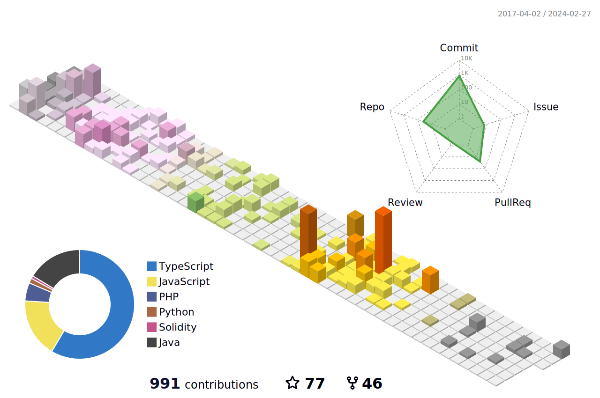

### Hi there 👋

I have over 7+ years of experience in Full stack & Blockchain technology development and IT consult.

Passionate about launching, developing, and maintaining web and mobile projects requiring a
broad yet experienced skillset. Intuitive problem-solving skills and proficient in front and
back-end development, mobile app development, system and application security, auditing
and project management and blockchain technology.

 

<h3 align="left">Languages and Tools:</h3>

 
    
   
   
   
   
   
    
   
    
    
   
   
  
   

  

  
